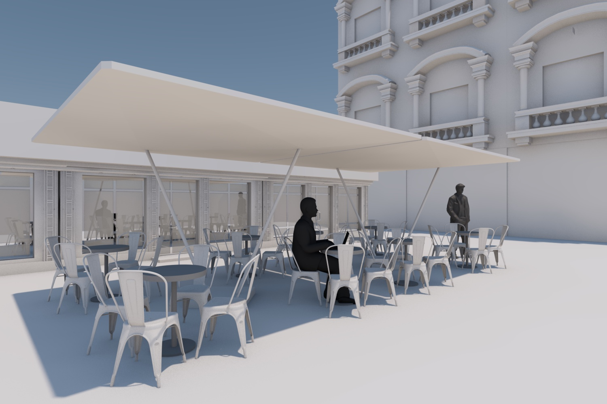
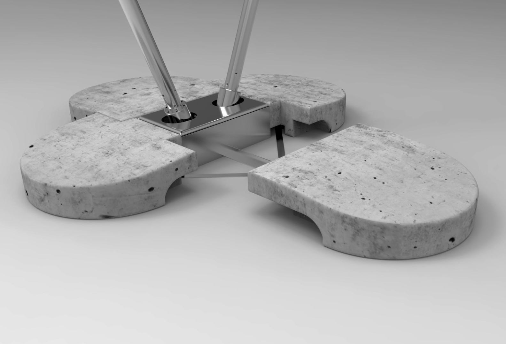

## Atum Shade

### Atum, a lemenő nap, a fény kitakarója

A napernyő tervezésének első gondolata abból fakadt, hogy sok olyan tervezési munkánk volt és van, ahol városi terek, vendéglátó teraszok kialakításával foglalkozunk. Kutatásaink során jutottunk arra a megállapításra, hogy igazán érdekes és szép mobil napernyő jelenleg nincs a piacon. A jellemzően városi szövetbe kerülő elemek felülnézeti képe is nagyon fontos, hiszen a környező épületekből nézve a tereknek felülnézeti képe is van. Ez szülte a gondolatot, hogy valósítsuk meg mi azt a napernyőt, ami mind megjelenésében, mind működésében új színt hoz az árnyékoló megoldások szegmensébe.

### Építészeti szempontok
Számunkra nem csak az épület fontos, hanem a környezet is, ami a köztes teret és ezáltal a házak külső megjelenését is jelentősen meghatározza. Éppen ezért az árnyékoló tervezésénél a városi teret és annak elemeit vizsgáltuk. A városszövetben kialakult teraszok és kerthelységek meghatározó elemei az utcaképnek. A mobil árnyékolóval ebben a kontextusban kezdtünk foglalkozni.
A meglévő termékek feltérképezése során jutottunk arra következtetésre, hogy nem találunk az általunk támasztott esztétikai igényeknek megfelelőt. Célunk a funkcionalitás kielégítése mellett egy egyszerű, letisztult formával megjelenni a városkép sokszínűségében. Nagyon fontos a tömegbeli megjelenés, a felülnézet és a lefedett tér arányai és térérzete. A megoldást egy egyszerű formában láttuk, melynek szerkezeti kialakításához a konstrukciós elvet a hagyományos esernyő-szerkezetekkel ellentétben egy teljesen újragondolt, egyedi megoldás adja. További újítást jelent még, hogy terveink szerint minden nézetből szövet fedi a szerkezetet, így a forma egyszerűségét a szerkezeti elemek látványa sem bontja meg.

A forma megtervezésénél fontos szempont volt, hogy a napernyő önmagában és csoportban használva is elegáns látványt nyújtson, így biztosítva, hogy a tervezett árnyékoló jól alkalmazható legyen a lefedni kívánt terület méretétől függetlenül. A sorolhatóság az árnyékvetés tekintetében is meghatározó.
Felülnézeti szempontból végül három geometria mellett döntöttünk, így lett a kezdeti 9 forma kör, háromszög és négyszög alapú, amelyek sík, kétszer görbült felületű és tömegszerűek lehetnek, ímiből létrejön egy 3x3-as mátrix. A kialakult vázlatok között dimenziójukat tekintve is több lehetőség van.
A menetrendünk szerint az előképek összegyűjtése és megvizsgálása után kiindulásként először egyetlen forma szerkezetének kidolgozásával foglalkozunk, amit a későbbiekben kiindulási alapként tekintünk a többi tervezése során.

### Konstrukciós szempontok
Az összetett csuklós rendszerek egyik meglepő, túlhatározott példája az 1903-ból származó Bennett mechanizmus. A túlhatározott rendszerek fejlődése nyomán kezdődtek kutatások a megfelelően feszített téralkotó szerkezetek iránt, Tensegrity néven. A biológiai tudományok fejlődésével a 70-es években vált világossá a kapcsolat a túlhatározott csuklós szerkezetek, a tensegrity és a biológiai struktúrák között. Ennek legékesebb példája a citoszkeleton, amely minden sejt szerkezeti vázát képezi. Ennek rugalamsan alakíthatónak, bővíthetőnek és stabilnak kell lennie.

A mikrobiológiai példákon túl az elmúlt évtizdeben számtalan példa került felszínre a makrobiológia világából is. Számtalan növény napi szinten kinyitja és becsukja a leveleit, vagy virágának szírmait. A növényi mozgások mind klasszikus csuklók nélkül működnek. Minden mozgást nyomott és húzott elemek elválaszthatatlan hálózataként oldanak meg.

### Biológiai formaanalógia:
Az élővilágban a virágok szirmai és a növények levelei az évszaknak-, a napszaknak megfelelően és az időjárási hatásokra reagálva  viselkednek. Ez a viselkedésminta a tervezett árnyékoló egyik inspirálója. A természetből merített ihlet segített minket abban, hogy épített környezetünkben az árnyékolás minőségével kapcsolatban általunk megfogalmazott kritériumokra organikus és egyben esztétikai szempontból igényes megoldást találjunk. Minden általunk megfogalmazott napernyőforma analóg egy a természetben megtalálható növény bizonyos formai-, működési részleteivel. Egy-egy éppen leszállt pitypangmagra emlékeztetve, az árnyékolók általános szerkezete, aránya és alakja légies. A természetes korrespondenciák nemcsak esztétikai élményéből, hanem funkcionalitásából, az úgynevezett „biológiai dizájn” formatárából merítenek ihletet az ernyő különböző alakjaiban megnyilvánulva. A változatos formák kombinálásából egy olyan organikus, szelíd mikrokozmosz-szerű boltozat alakítható ki, amely felidézi a természet nyugtató érintését a város szívében.

A kör alakú ernyő a hűs víz felszínén lebegő, szárát a mélybe engedő tündérrózsa levelére hasonlítanak. A levél struktúráját alapul véve az ernyő egyik pontján be van irdalva a közepe felé. A vízinövénynél ez az irdalás a levél enyhe csavarását eredményezi, amely jobban átengedi a víztükör áramlatait. Ezzel a morfológiai sajátossággal a megtervezett ernyő ugyanúgy a levegő szabad áramlását teszi lehetővé.

A kör egy másik változata jelenik meg a friss rózsaszirom puha formáját és hajlatait felidéző ernyőnél. A szirom finoman ívelő ovális alakja a késő tavasz buja virágzását, a természet kedves, óvó és lágy ölének emlékét elevenítik fel. A szirom hullámos íve visszaköszön az ernyő domború-homorú formájában, erezetét pedig a vékony feszítő pálcák jelenítik meg. A líraibb, poétikusabb, romantikusabb alakú ernyő egy, a lehullásában fejünk felett megállított lágy boltozatot alkot.

A háromszög ritkábban látható, de szintén növényi forma. A nyíl alakzatú ernyő bizonyos, kevésbé ismert vadvirágok, mint például a Parajlibatop lándzsás levelének formájára utal, amely a nyári rét és a meleg hónapok könnyedségét és szabadság érzését kelti fel. A stilizált levélalak egyrészt aerodinamikus, másrészt könnyen kombinálható. Az alapformát ily módon bővíthetővé téve, akár nagyobb négyszög is kialakítható.

A négyszögletes alaprajzú napernyők a két termőlevélből kialakult, kétrekeszű magrejtőre, a becőre vezethetők vissza. Habár a magrejtő formája kissé kerekdedebb, formavilága, párnássága ihlette a napernyő megjelenését. Városi környezetben gyakran felmerülő igény a párhuzamos rendezhetőség. Erre az elvárásra reflektál ez a harmadik, a négyszögletes alaprajzi forma. 

A tervezett napernyők között mindhárom alaprajzi formából találunk párnaszerűen kialakított alul-felül szövettel fedett változatokat. Ezek a formák a bugás csörgőfa tokterméseit idézik, amik hólyagszerűen felfújva levegővel teli, könnyed testekként jelennek meg a fák ágain. Ezeknek a növényeknek a tulajdonságai is szerepet játszottak  a napernyők légies megjelenésének kialakításában, aminek hatását a szerkezet elrejtése tovább fokozza így téve még súlytalanabbá azt.
 
Továbbvezetve a gondolatot eljutunk a tervezett célig: a belülről világító búrák szintén egy létező, bizonyos növények fényraktározó és a fényt éjszaka visszasugározó képességéből merít ihletet. A világító egységekké fejlesztett ernyőalakok a biolumineszcencia természetes jelenségére reflektálnak, melynek a számunkra legismertebb képviselői az éjjel fluoreszkáló gombák. Csodálatos látványukból kiindulva a multifunkcionális ernyő-búrák éjszaka nem csak védenek, hanem világítanak is, mint egy mesebeli erdőben messziről meglátott fénypont.

### A konstrukció kialakításának analógiája
A tudományos irodalomban található elemzések és saját nagyméretű feszített ernyőkkel szerzett tapasztalataink alapján kezdtünk bionikus csuklómechanizmusokkal kísérletezni. Saját kutatásunk ereményeképpen bizonyosodtunk meg, hogy a környezetünkben fellelhető számtalan összetett csuklós szerkezet mechanizmusa leegyszerűsíthető, vagy teljesen kiváltható bionikus elvekkel. Ezek a tárgyak nem igénylenek nagy ismétlési pontosságot, így a biológiai alapokon nyukvó csuklómechanizmusok költséghatékony technológiákkal is tökéletesre készíthetőek megfelelő elrendezések mellett. 

Kutatásunk olyan tudományos újdonságú gépelemek létrehozására irányul, amely hasznosítja a bionikus mechanizmusok előnyeit a hétköznapjainkban is fellelhető tárgyakban. Ezek a gépelemek önmagukban is számtalan gyártó által alkalmazható, valamint saját műhelyünkben is előállíthatóak bizonyos részei. Ennek szemléltetéseképp egy termék javaslatot is össze raktunk és nagyméretű árnyékoló építésébe keztünk a bionikus elveink segítégével. Az így születő árnyékoló várható tulajdonságai a legkeresettebb tényezők között vannak a piacon.

A kutatási anyag tartalma a bionikus mechanizmus elve. Ez az elv egy olyan elv, amelyet más szakterületeken is lehet alkalmazni. Ezeknek a szakterületeknek a kutatói minden bizonnyal számtalan további előnyös működési formát fognak felfedezni és hasznosítani. Összeségében ez a tudományos fejlődésen túl más szakterületek fejlődéséhez is hozzájárulhat. Ami a piaci szereplőknél is munkahely teremtő hatással bír. A bionikus mechanikáink működési tulajdonságai a gyártópartnereink folyamataihoz igazodik, de az általánosnál kevebb idő és energia befektetéssel jár, így az ezzel az elvel készülő termékek környezeti lábnyoma is jelentősen csökken.

A prototípusból fog látszani egy konkrét termék, amelyre az elv használható. A bionikus árnyékoló, amely a legkézenfekvőbb alkalmazási területnek tűnik olyan tulajdonságokkal rendelkezik, amellyel egy versenytársa sem. Egy átlagos nagyméretű árnyékoló alkatrészszáma 40 fölött van, a bionikus rendszerünkkel ezt 8 alá lehet csökkenteni. A jelentősen csökkent alkatrész szám mellett az egyes alkatrészek bonyolultsága is csökken a rendszerünkben, ami további gyártási költségcsökkenéshez vezet. Az alacsony alkatrész szám a szerelési és karbantartási költségeket is csökkenti, amely tulajdonságok rendkívül kívánatosak mind a garancia kezelő értékesítő partnerek, mind az üzemeltetést végző végfelhasználók körében.
Az egyedülálló bionikus mechanikai elv a környezetünkben fellelhető csuklómechanizmusokkal rendelkező termékek gyártási költségeit és bonyolultságát nagymértékben csökkenti. A közvetlen felhasználási területein túl, a létrejövő eredmények hasznosíthatóak különleges környezetekben, kezdve a vész esetén felhúzott ideiglenes óvósátraktól, az űrkutatásban alkalmazott nagyméretű napelemek mechanizmusáig. Több országban külön kutatási alap lett létrahozva az ehhez hasonló elvekkel kapcsolatos tudományos munkára, ezért az általunk kidolgozott feszített bionikus mechanikai elvek nemzetközi jelentősséggel bírnak. Közvetlenül hozzájárul az alkalmazásával az előállítási bonyodalmak csökkentéséhez, ezzel mérsékelve a károsanyag kibocsátást, ami a környezetünk fenntartását segíti. Vizuális megjelenése esztétikus, így design és az élhető környezet is profitál belőle. Közvetlen alkalmazási területei például az árnyékolók, ami a fa és textil ipar produktumait hasznosítja, amelyek megújuló forrásokból is származhatnak.

Több szakterületre gyakorolt jelentős hatásából a legkiemelkedőbb a bionika. A tudományos munkánk létrejövő konkrét termékeken túli eredménye, hogy újabb kutatásokat inspirálhat. Ezzel hozzá járulva a hazai bionikai kutatások fejlődéséhez, ami a hazai tudományos élet előmenetelének egyik eleme.

A kutatás eredményeképp létrejövő elveket egy kézenfekvő termék formájába öntöttük. A termék a piacon fellelhető árnyékolók teljes formai és mechanikai kialakítását megreformálja. Nem csak működtetésében nyújt lenyűgöző látványt, de egyedülálló tulajdonságainak köszönhetően megkönnyíti a karbantartást, gyártást és az egyedi beépítési formákat is. Mivel az ára jelentősen alacsonyabb lehet versenytársainál, így a városi árnyékoló rendszerekben domináns szerepre számíthatunk, amely a rendkívüli esztétikáján keresztül a vizuális környezetünk jelentős fejlődéséhez vezet.

Legnagyobb piaci igény várhatóan az elv igazolásaként létrejövő árnyékoló termék javaslatra lesz. Ez a legkézzelfoghatóbb eredményünk és egyben a legközérthetőbb is. A költséghatékony környezebarát megoldások minden ismert példában piaci sikert hoztak, azoknál a termékeknél, amelyek valós igényre épültek. A teljes kutatási anyagunk inspirációját olyan munkáink adták, amelyekben a megbízók, esztétikus, környezetbarát és költség kímélő megoldásokat kerestek a piacon fellelhető kész megoldásokkal szemben. Több szakmai fórumon is hangoztatják az egyedi megoldások létjogosultságát a azárnyékolás technikában. A bionikus gépelemeink variálásával, ugyan arra a működési elvre több formavilág is felépíthető, amellyel nagyobb és változatos ízléső réteg szolgálható ki. Az egészen extrém szögletes struktúráktól kezdve a lágy növényszerű, organikus formákig a teljes spektrum lefedhető az elvünkre épülő elemekkel. 

Az árnyékoló prototípusonk célcsoportja a Hotelek, éttermek, strandok, fesztivál- és rendezvényszervezők és egyedi beruházók. 

### Kapcsolat

[minusplus.hu](http://www.minusplus.hu/)
